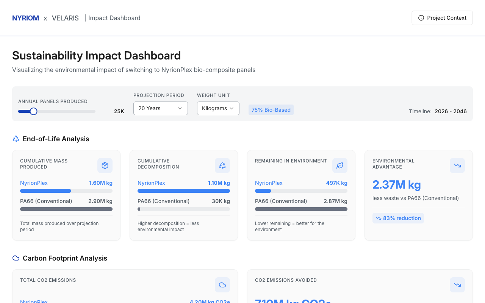
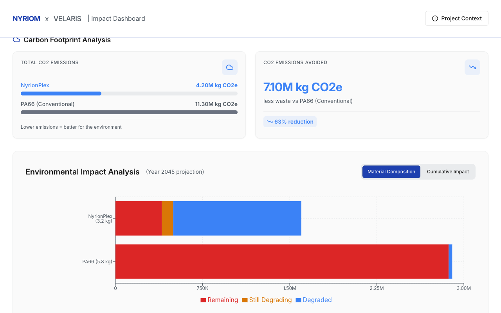

# Nyriom x Velaris — Sustainability Dashboard

Interactive simulation dashboard that models the environmental impact of replacing conventional PA66 aerospace interior panels with NyrionPlex bio-composite panels.

**[Live Demo](https://nyriom-dashboard.vercel.app)**

[](https://nyriom-dashboard.vercel.app)

[](https://nyriom-dashboard.vercel.app)

## The Problem

Procurement teams evaluating a material switch from conventional plastics to bio-composites need long-range projections — waste accumulation, CO2 footprint, end-of-life behavior — before they can build an internal business case. Spreadsheets don't communicate the story well enough for stakeholder buy-in.

## The Solution

A browser-based dashboard that runs a batch-tracked degradation simulation and visualizes the results across multiple dimensions:

- **End-of-life analysis** — cumulative mass produced, decomposed, and remaining in the environment for both materials side by side
- **Carbon footprint comparison** — total CO2e emissions and avoided emissions over the projection period
- **Material composition breakdown** — stacked bar chart showing remaining, still-degrading, and fully-degraded fractions
- **Adjustable inputs** — annual panel volume (10K–100K), projection period (5–30 years), weight unit toggle (kg/lbs)

## How the Simulation Works

Each year's production is tracked as an independent batch. NyrionPlex bio-based content degrades linearly over its decay period; PA66 decomposes at a negligible fixed rate.

| Parameter | NyrionPlex | PA66 (Conventional) |
|-----------|-----------|-------------------|
| Panel weight | 3.2 kg | 5.8 kg |
| Bio-based content | 75% | — |
| Degradation period | 4.2 years | 600+ years (0.1%/yr) |
| CO2e per panel | 8.4 kg | 22.6 kg |

Constants are defined in `client/src/lib/calculations.ts`.

## Tech Stack

React · TypeScript · Vite · Tailwind CSS · shadcn/ui · Recharts · Express

## Architecture

```
client/
  src/
    pages/Dashboard.tsx          # Main dashboard page
    components/
      DashboardHeader.tsx        # Branding bar
      InputControls.tsx          # Slider, dropdowns, timeline
      KPICardsGrid.tsx           # End-of-life KPI cards
      CO2KPICardsGrid.tsx        # Carbon footprint KPI cards
      ComparisonKPICard.tsx      # Side-by-side material comparison
      DeltaKPICard.tsx           # Advantage/reduction card
      VisualizationSection.tsx   # Charts (composition + cumulative)
      ChartToggle.tsx            # Chart tab switcher
      ContextDrawer.tsx          # Project context side panel
      DashboardFooter.tsx        # Disclaimer + credits
    lib/
      calculations.ts            # Simulation engine + constants
server/
  index.ts                       # Express entry point
  routes.ts                      # API routes
  static.ts                      # Static file serving
shared/
  schema.ts                      # Shared type definitions
```

<details>
<summary><strong>Local Development</strong></summary>

```bash
git clone https://github.com/lorenzo-leprotti/nyriom-dashboard.git
cd nyriom-dashboard
npm install
PORT=3000 npm run dev
```

No API keys or environment variables needed. The simulation runs entirely client-side.

</details>

## Related Projects

| Project | Description | Stack |
|---------|-------------|-------|
| [Nyriom Intelligence](https://github.com/lorenzo-leprotti/nyriom-intelligence) | Competitive intelligence monitoring platform | Python · Flask · PostgreSQL |
| [Nyriom List](https://github.com/lorenzo-leprotti/nyriom-list) | Supplier qualification tracker | React · TypeScript · Supabase |

## Disclosure

Nyriom Technologies and Velaris Aerostructures are fictional companies. This project was built as a portfolio piece to demonstrate dashboarding, data visualization, and simulation modeling in a realistic B2B context. All data is synthetic.

## License

[MIT](LICENSE)
